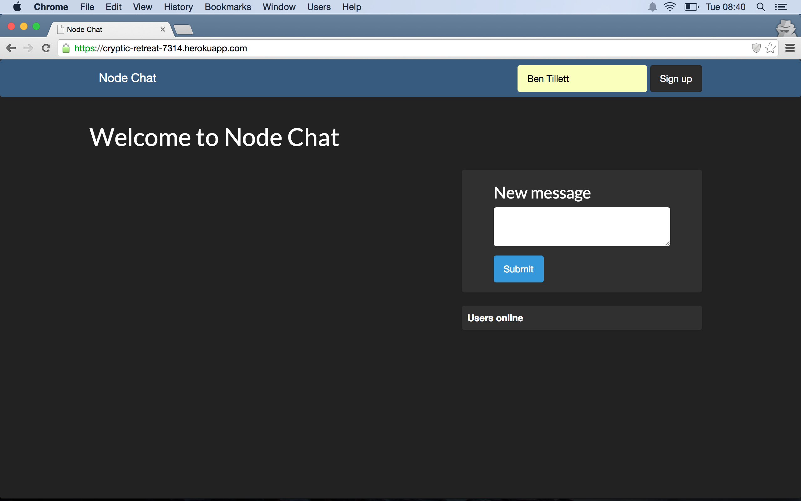
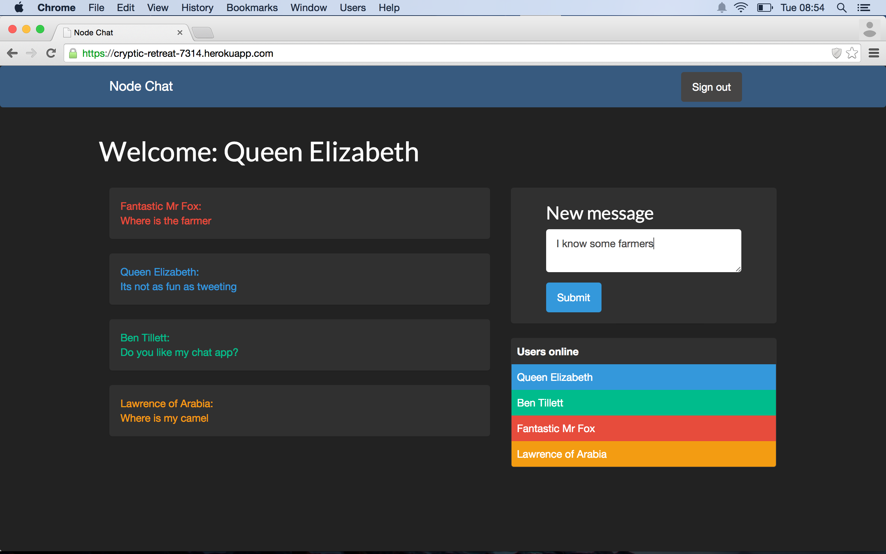
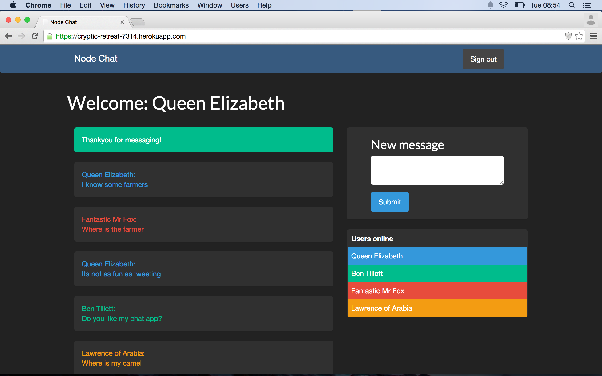

Node chat
==========

In progress!!!

A chat application written with node.js express, mongodb and mongoose. 
Tested with mocha and Zombie

Skills learnt/used
-----------------
> * TTD - with Mocha and zombie
> * Nosql - with MongoDb
> * Node.js
> * Express


[click here](https://cryptic-retreat-7314.herokuapp.com/) to check it out online.



Sign up!



Send a message...



Take a look


How to use
----------

Clone the repository:

```shell 
$ git clone git@github.com:benjamintillett/node_chat.git
```


run mocha to view the tests:

```shell 
$ mocha
```

Start up the server 

```shell 
$ npm start
```

Point your browser to localhost:3000