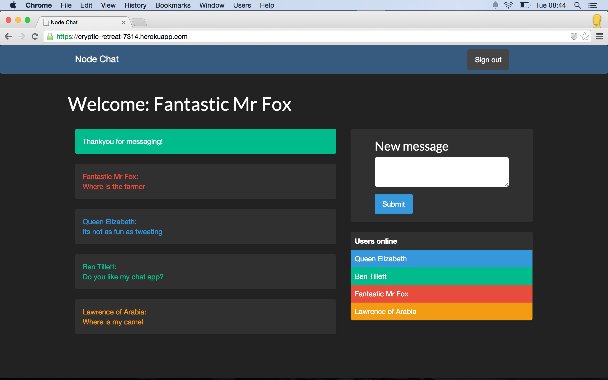

Node chat
==========

In progress!!!

A chat application written in node using web sockets mongodb and angular.js.

Skills learnt/used
-----------------
> * TTD - with Mocha and zombie
> * Nosql - with MongoDb
> * Node.js
> * Express
> * Mocha
> * socket.io




How to use
----------

Clone the repository:

```shell 
$ git clone git@github.com:benjamintillett/node_chat.git
```


run rspec to view the tests:

```shell 
$ mocha
```

Start up the server 

```shell 
$ npm start
```
Point your browser to localhost:3000